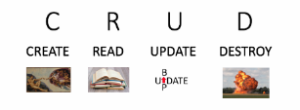

# Story Editor &nbsp;&nbsp;&nbsp;&nbsp;&nbsp;&nbsp;  #

## Story Editor Project, Week Eight, Skill Distillery ##

### Technologies Used ###

* Java
* Gradle
* SpringMVC
* JPA
* STS Debug
* JUnit Jupiter
* Git
* GitHub
* Bootstrap
* SQL
* AWS

### Story Editor Functions ###

* Enter a number to search for a story or just click on a link to the story in the list.
* Stories are listed on the homepage by their id number.
* Click "Add Story" to add a story.
* Click on a story to update or delete the story.
* On the story's display page, click update or delete to update or delete the story.
* On the update page, put in any changes you would like and click "Update Story."
* Example database online: [Story Database](http://www.jaloway.com:8080/SpringMVCBitmap/)

### Notes ###

* I really enjoyed this project although when I showed it to my wife, it was very similar on the front end to previous homework projects. I had to explain that it was very different on the back end.
* This project went a lot faster in the actual coding because of JPA. The initial configuration took longer but after that was over things moved faster.
* I was able to make the output look good a lot faster this time around. I am getting more familiar with using simple bootstrap configs.
* I got stuck for a little while on some problems with creating tests for my controller. It turned out that everything was almost functioning correctly. I just needed to actually run it live to see that. For JUnit tests Spring requires some extra configuration.

<!---
How to run. - Done
What it does. -
List the technologies you used.
Explain how it went for me.
 --->

Thanks,

             ____                      _             
            |  _ \                    | |            
            | |_) |_ __ __ _ _ __   __| | ___  _ __  
            |  _ <| '__/ _` | '_ \ / _` |/ _ \| '_ \
            | |_) | | | (_| | | | | (_| | (_) | | | |
            |____/|_|  \__,_|_| |_|\__,_|\___/|_| |_|
